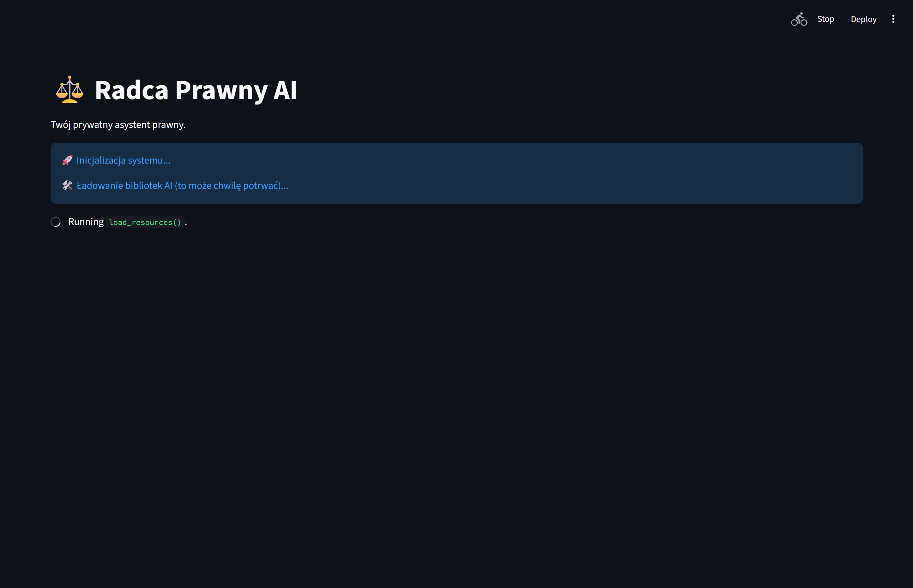
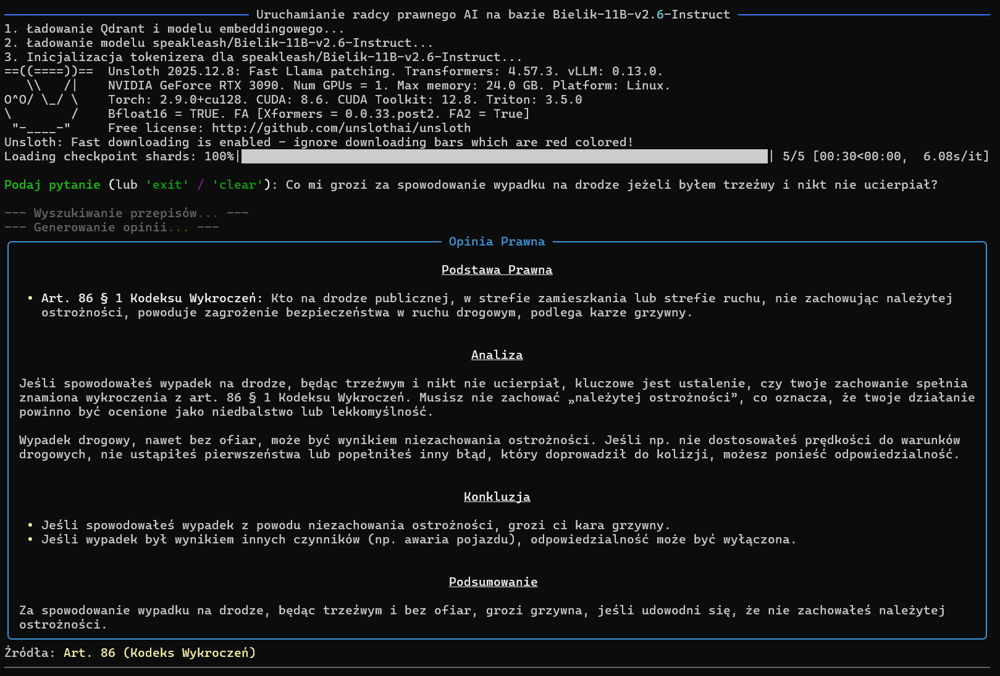
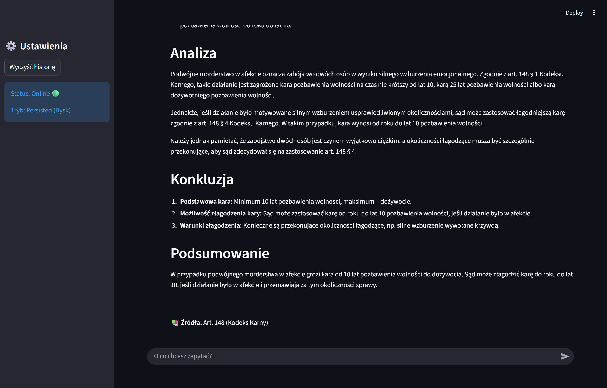
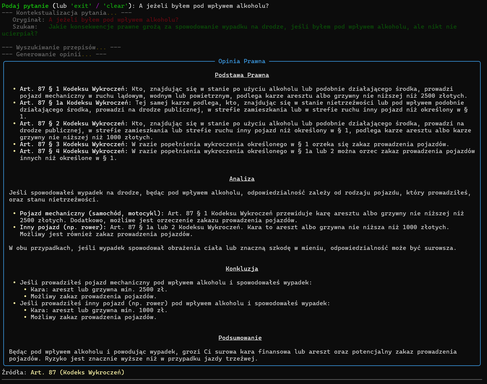

# ⚖️ Radca Prawny AI

**Radca Prawny AI** to zaawansowany system **RAG (Retrieval-Augmented Generation)** zaprojektowany do udzielania porad prawnych w oparciu o polskie ustawodawstwo. Projekt działa w 100% lokalnie, wykorzystując moc obliczeniową karty graficznej, co gwarantuje pełną prywatność danych.

System łączy **Wyszukiwanie Hybrydowe** (Semantyczne + Słowa Kluczowe) i **Reranking** z potężnym polskim modelem językowym (**Bielik-11B**), aby dostarczać precyzyjne odpowiedzi sformatowane jak profesjonalne opinie prawne.


## 🚀 Możliwości

* **100% Offline & Private:** Żadne dane nie wychodzą poza Twoją maszynę. Idealne do analizy wrażliwych spraw.
* **Persistent Chat History:** Pełna historia rozmów zapisywana na dysku. Możesz tworzyć nowe sesje, wracać do starych wątków i usuwać niepotrzebne rozmowy z poziomu panelu bocznego.
* **Advanced Hybrid Search:** Trzystopniowy proces wyszukiwania:
    1.  **Dense Retrieval:** Wektory semantyczne (`e5-large`) do zrozumienia kontekstu.
    2.  **Sparse Retrieval:** Wektory rzadkie (`BM25`) do precyzyjnego wyszukiwania słów kluczowych i numerów artykułów.
    3.  **Cross-Encoder Reranking:** Ponowna ocena i sortowanie wyników przez model `polish-reranker-roberta-v3` dla maksymalnej trafności.
* **Multi-Code Retrieval:** Przeszukuje jednocześnie wiele aktów prawnych (Kodeksy: Karny, Cywilny, Pracy, Wykroczeń, Rodzinny oraz Konstytucję RP).
* **Smart Context Awareness:** Mechanizm `Query Rewriting` analizuje historię czatu, aby zrozumieć pytania nawiązujące do poprzednich wypowiedzi (np. "A co jeśli...").
* **Profesjonalny Format:** Odpowiedzi są generowane w ustrukturyzowanej formie (Podstawa Prawna -> Analiza -> Konkluzja).
* **Strict Grounding:** Model posiada silne zabezpieczenia przed halucynacjami – bazuje wyłącznie na dostarczonym kontekście (RAG).

## 🛠️ Stack Technologiczny

* **LLM:** `speakleash/Bielik-11B-v2.6-Instruct` (Kwantyzacja 4-bit NF4).
* **Embeddings (Dense):** `intfloat/multilingual-e5-large`.
* **Embeddings (Sparse):** `Qdrant/bm25` (via FastEmbed).
* **Reranker:** `sdadas/polish-reranker-roberta-v3`.
* **Vector Database:** `Qdrant` (Tryb lokalny/embedded).
* **Ingestion:** `Docling` (Konwersja PDF do Markdown).
* **UI:**
    * **Web:** `Streamlit` (Interaktywny czat z historią sesji, renderowaniem Markdown i zarządzaniem rozmowami).
    * **Terminal:** `Rich` (CLI).
* **Engine:** `Unsloth` (Inference optimization) + `BitsAndBytes`.

## 📚 Baza Wiedzy

Projekt automatycznie pobiera, przetwarza i indeksuje następujące akty prawne (aktualne wersje z ISAP):
* Konstytucja Rzeczypospolitej Polskiej
* Kodeks Karny (KK)
* Kodeks Cywilny (KC)
* Kodeks Pracy (KP)
* Kodeks Rodzinny i Opiekuńczy (KRO)
* Kodeks Wykroczeń (KW)

## ⚙️ Instalacja

### Wymagania
* System: Linux (zalecane) lub Windows (WSL2).
* GPU: NVIDIA z min. 24 GB VRAM (RTX 3090/4090).
* RAM: 32 GB+.
* Python: 3.10+.

### Kroki

1.  **Sklonuj repozytorium:**
    ```bash
    git clone https://github.com/Inexpli/Radca-prawny-AI
    cd Radca-prawny-AI
    ```

2.  **Utwórz wirtualne środowisko i zainstaluj zależności:**
    ```bash
    python -m venv .venv
    source .venv/bin/activate  # Linux/WSL
    # .venv\Scripts\activate   # Windows PowerShell
    
    pip install -r requirements.txt
    ```
    *(Upewnij się, że masz zainstalowany PyTorch z obsługą CUDA)*

3.  **Zbuduj bazę wiedzy (Ingest):**
    Skrypt pobierze PDF-y, przekonwertuje je na Markdown, wygeneruje wektory hybrydowe i zapisze w Qdrant.
    ```bash
    python ingest_data.py
    ```

## ▶️ Użycie

Możesz korzystać z systemu na dwa sposoby.

### 1. Interfejs Graficzny (Rekomendowane)
Uruchamia nowoczesną aplikację w przeglądarce z pełną historią sesji.

```bash
streamlit run app.py
```




### 2. Wersja CLI
Klasyczny terminal dla szybkiego testowania i debugowania.

```bash
python main.py
```




## 📄 Licencja
- MIT License
